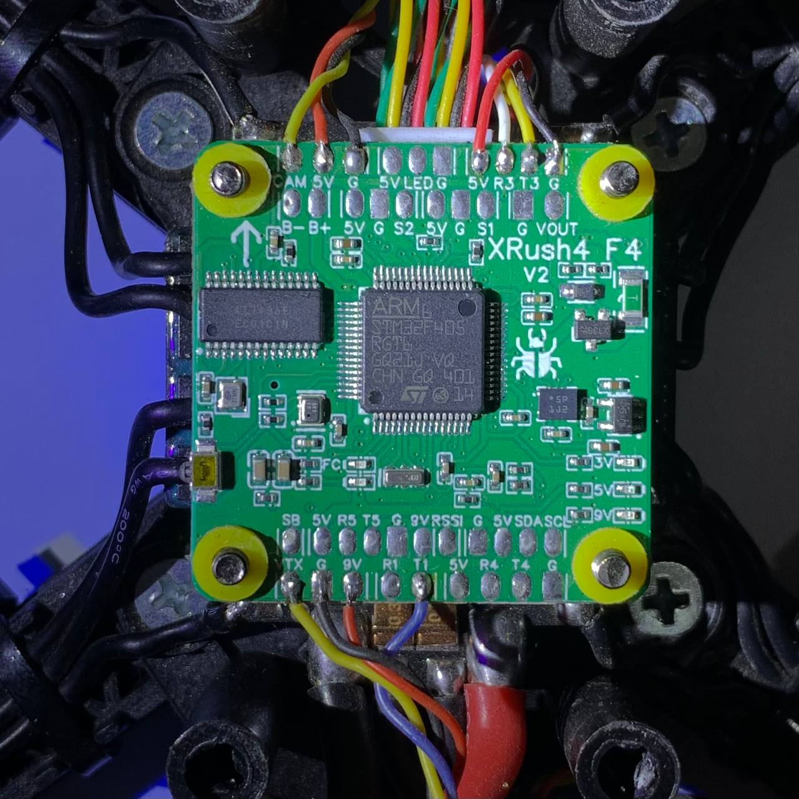
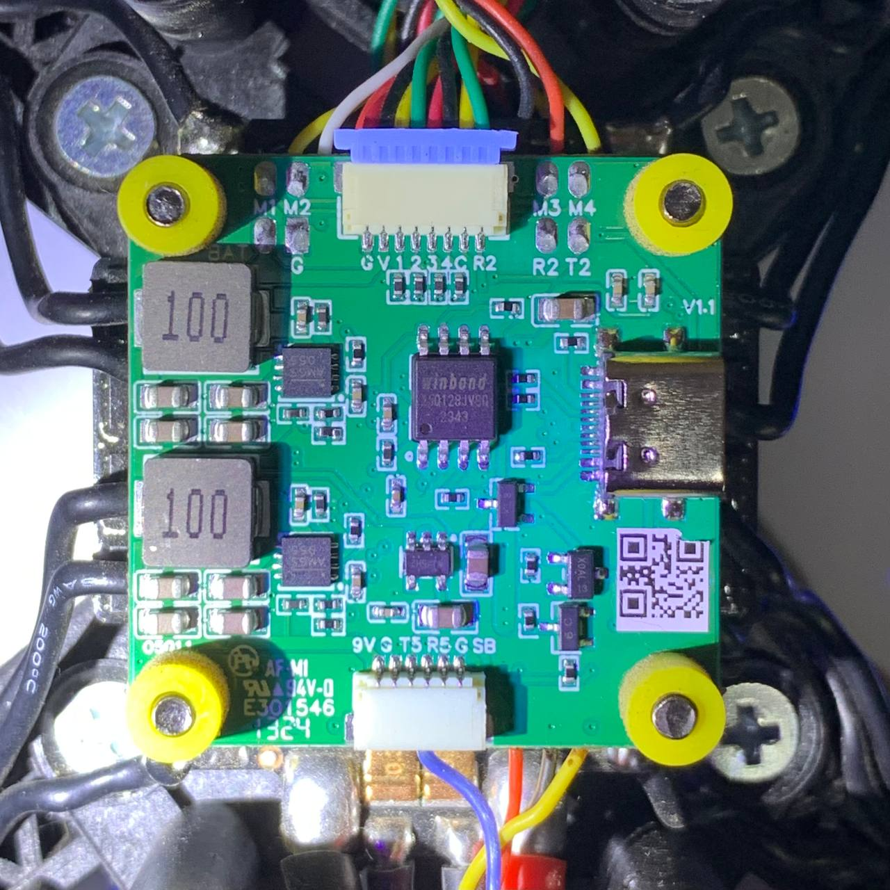
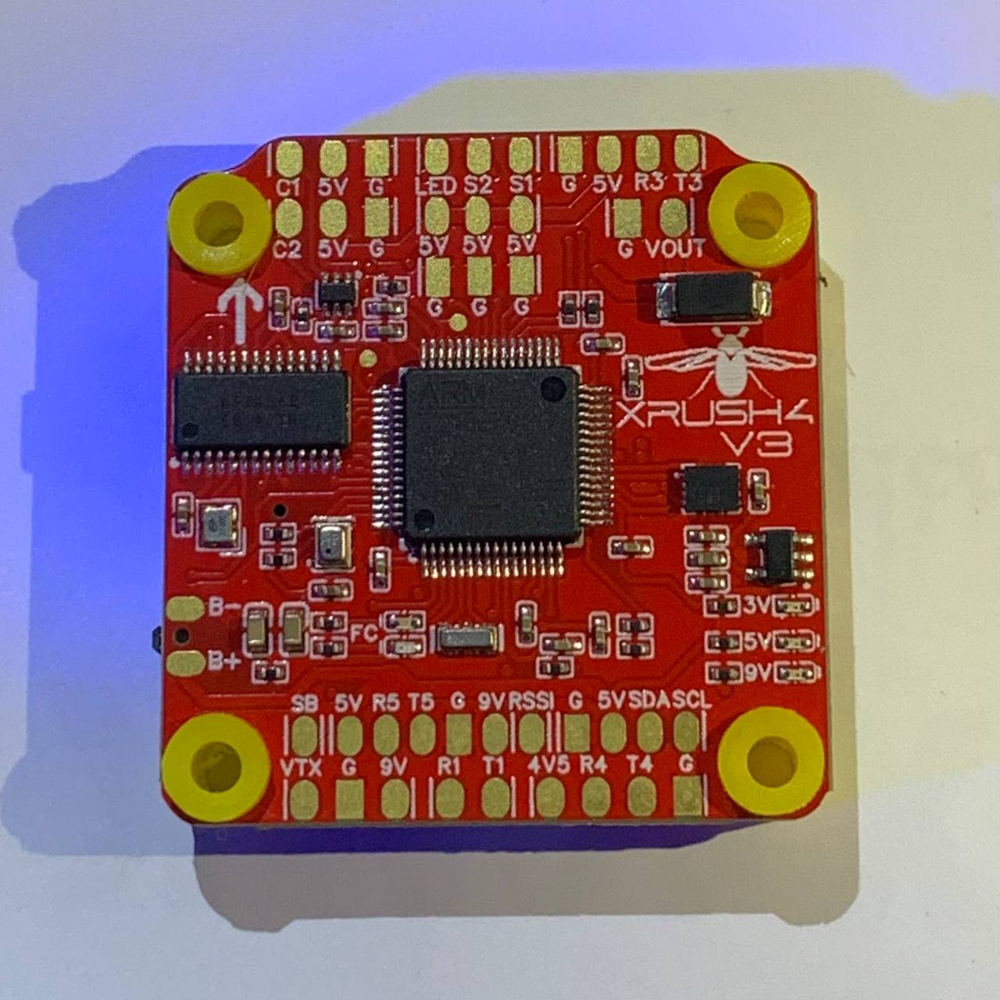
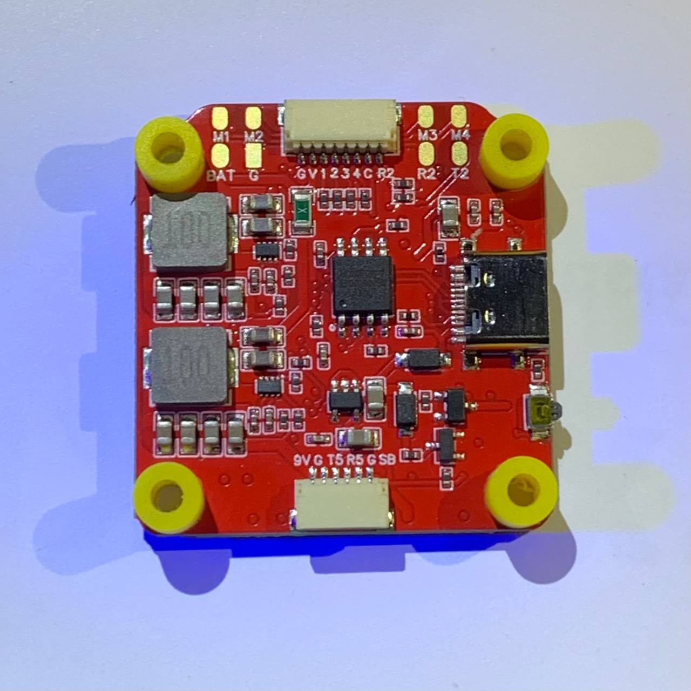
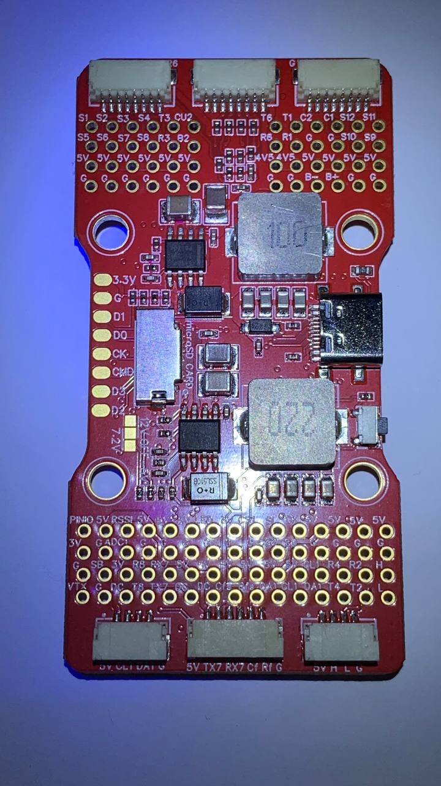
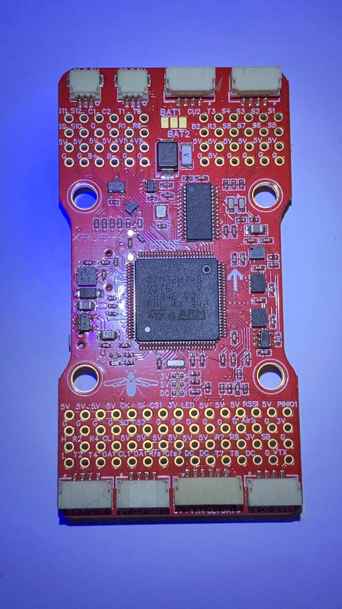

# XRush4 ArduPilot

В даному репозиторії ми розміщуємо актуальні версії прошивки ArduPilot для політних стеків [XRush4](https://xrush4.tech/). А також тут можна подискутувати стосовно роботи ArduPilot на політних стеках XRush4.

> Через деякий час код прошивки з'явиться в офіційному репозиторії [ArduPilot](https://github.com/ArduPilot/ardupilot)

### Версії

| Стек | Номер версі | Документи | Статус |
| ----------- | ----------- | ----------- | ----------- |
| XRush4F4V2 | XRush4F4V2.23.0 | [XRUSH4-F4V2_Datasheet](https://xrush4.tech/wp-content/uploads/2025/01/XRUSH4-F4V2_Datasheet.pdf) | BETA2 |
| XRush4F4V3 | XRush4F4V3.15.3 | [Xrush4_F4V3_Manual_Rev.2.0](https://xrush4.tech/wp-content/uploads/2025/05/Xrush4_F4V3_Manual_Rev.2.0.pdf) | BETA1 |
| XRush4H743V1 | XRush4H743V1.12.7 | ... | BETA0 |

## Зображення

### XRush4 F4 V2

### XRush4 F4 V3

### XRush4 H743 V1

