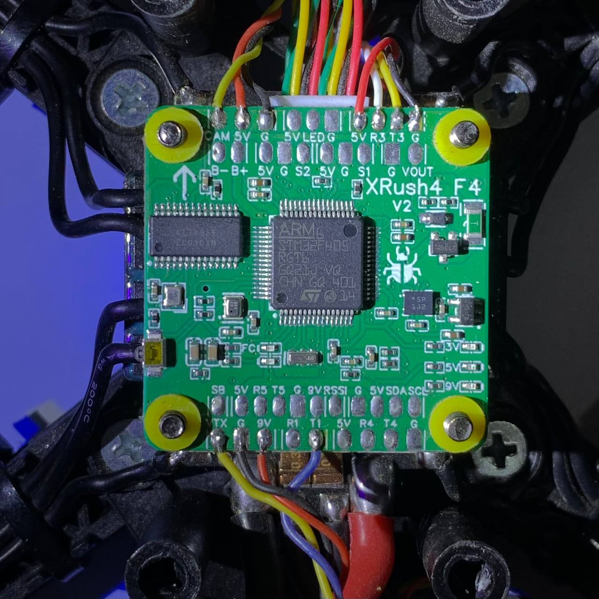
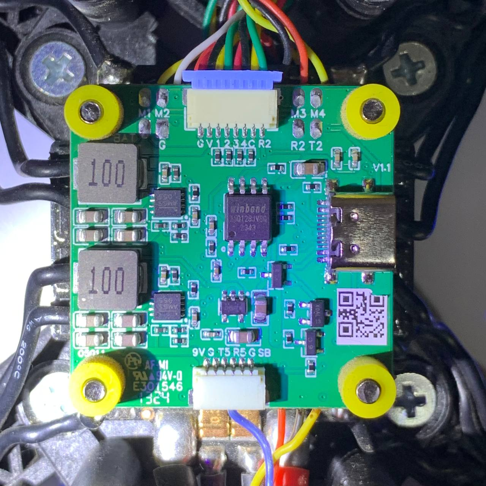

# XRush4F4V2 Flight Controller

uk_UA: [україномовна документація та прошивки в репозиторії](https://github.com/CO-CF-TECHNO4/XRush4-ArduPilot)

[XRush4 F4 V2 official site](https://xrush4.tech/xrush4-f4-v2/)

## Features

 - STM32F405 microcontroller
 - BMI270 IMU
 - BMP280 Baro
 - AT7456E OSD

## Datasheet

[XRUSH4-F4V2_Datasheet](https://xrush4.tech/wp-content/uploads/2025/01/XRUSH4-F4V2_Datasheet.pdf)

## UART Mapping

|Name|Function|
|:-|:-|
|SERIAL0|USB/MAVLink|
|UART1||SerialProtocol_Tramp|
|UART2|SerialProtocol_None|
|UART3|SerialProtocol_ESCTelemetry|
|UART4|SerialProtocol_RCIN|
|UART5|SerialProtocol_None|

## OSD Support

## PWM Output

## Battery Monitoring

## Compass

The XRush4 F4 V2 does not have a builting compass.

## Alternate settings

## Loading Firmware

Initial firmware load can be done with DFU by plugging in USB with the
bootloader button pressed. Then you should load the "with_bl.hex"
firmware, using your favourite DFU loading tool.
